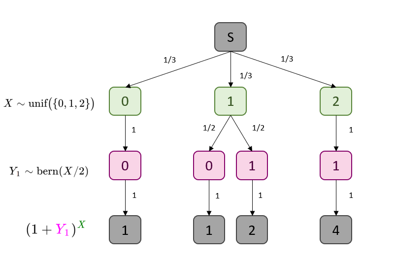

```{r setup, include=FALSE}
knitr::opts_chunk$set(echo = TRUE)
library(extraDistr)
```


## Question 1 : Sampling from a Joint Distribution

#### Part 1  \


Compute $\mathbb{E}[(1 + Y_1)^X]$ mathematically (with a precise mathematical derivation).


**Solution:** We wish to compute $\mathbb{E}(g, X, Y_1, \dots Y_4).$ In this case, $g(x, y_1, \dots y_4) = (1 + y_1)^x$.  We can hence write the expectation as follows:
      \begin{equation*}
          \mathbb{E}[g(X, Y_1, \dots, Y_4)] = \sum_x \sum_{y_1} \sum_{y_2} \sum_{y_3} \sum_{y_4} g(x, y_1, \dots, y_4)  p(x, y_1, y_2, y_3, y_4).
      \end{equation*}
      

This can be simplified slightly as follows:
      \begin{equation*}
          \mathbb{E}[(1 + Y_1)^X] = \sum_x \sum_{y_1} (1 + y_1)^x p(x, y_1, y_2, y_3, y_4)
      \end{equation*}


Further, we know the specific $y_2, y_3, y_4$ coin flip outcomes don't matter in this particular calculation, since our expectation is only in terms of $X$ and $Y_1$.
With this in mind, we can consider the following tree describing this situation.

<center>

{#id .class width=75% height=75%}

</center>

<!-- We can expand this as follows: -->
<!--       \begin{align*} -->
<!--           \mathbb{E}[(1 + Y_1)^X] = \sum_{x=0}^2 \sum_{y_1 = 0}^1 (1 + y_1)^x p(x, y_1, y_2, y_3, y_4) -->
<!--       \end{align*} -->

Then, applying the Law of the Unconscious Statistician (as seen in the bottom level of this tree), we can find $\mathbb{E}((1 + Y_1)^X)$. We use chain rule to propagate towards the probabilities aligning with the bottom leaves. 
  \begin{equation*}
          \mathbb{E}[(1 + Y_1)^X] = \frac{1}{3}(1) + \frac{1}{6}(1) + \frac{1}{6}(2) + \frac{1}{3}(4) = \boxed{\frac{13}{6}}
      \end{equation*}
<!-- Then, we let $p(x, y_1, \dots)$ be represented in this scenario as $P(X = x)P(Y_1 = y_1)$. -->
      
#### Part 2

Write an R function called `forward_sample` that samples (“simulates”) from the joint distribution of $(X, Y_1, Y_2, Y_3, Y_4)$. As a general practice, fix the seed, and submit both the code and the output (here, a single sample).

```{r fwd-samp}
library(extraDistr)
set.seed(19690720)
forward_sample <- function(){
      X = rdunif(1, 0, 2)
      return(
        c(X, sapply(1:4, function(x) rbinom(n = 1, size = 1, prob = X/2)))
      )
}
forward_sample()
```

### Part 3

How can your code and the law of large number be used to approximate $\mathbb{E}[(1 + Y_1)^X]$

Since the Law of Large numbers basically states that average of many *iid* random samples will approach the truth (if it exists), we can use our newly-created `forward_sample()` function to approximate via Monte Carlo simulation. We can conduct $m$ simulations, and let $\hat G_M = (1 + y_1)^x$. Then, the average given by $\hat G_M = \frac{1}{M} \sum_{m=1}^M G^{(m)}$ is approximately equal to $\mathbb{E}((1 + Y_1)^X)$. The actual code to do this is below:

```{r monte-carlo}
set.seed(19690720)
# declare number of iterations
num_iterations = 20000
# generate all simulations 
simulations = sapply(1:20000, function(x){
    # generate a sample using the forward_sample() function
    sample_i = forward_sample()
    # calculate g(x, y) using the generated sample
    g_x = (1 + sample_i[2])^sample_i[1]
    # return this iteration
    return(g_x)
})
```
<!-- Then, with each simulation, we compute $(1 + y_1)^x$. We can then approximate $\mathbb{E}[(1 + Y_1)^X]$ by taking the average of all our simulations. In short, we can generate Monte Carlo samples to generate an -->

### Part 4


Compare the approximation from your code with you answer in part 1.


Here, we actually conduct the simulations and compare the results to those found by arithmetic operations.

```{r simulations-check}
# generate the estimate of E(g(X, Y))
simulated_mean = mean(simulations)
# value from simulations
print(paste("Simulated Value:", simulated_mean))
# value from part 1
print(paste("Calculated Value:", round(13 / 6, 4)))
# (observed - expected)/(expected) as a percent
print(paste("Percent Difference: ",
            round(abs(
              simulated_mean - 13 / 6
            ) / (13 / 6) * 100, 4), "%", sep = ''))
```
So we can see that the result found from simulation is very close to that found in **Part 1**.

## Question 2 : Computing a Conditional

Suppose now that you observe the outcome of the 4 coin flips, but not the type of coin that was picked. Say you observe: "heads", "heads", "heads", "heads" = `[0, 0, 0, 0]`.

**Note:** We will use precise and careful notation to solve, not skipping any steps. 

### Part 1

Write mathematically: "Given you observe 4 heads, what is the probability that you picked the standard coin?"


We know that the coin flips are $Y_1, Y_2, Y_3, Y_4$ respectively. Based on the question description, for arbitrary $i \in [1,4]$ the event that a coin is "heads" is $Y_i = 0.$
    Therefore, we can all four flips as the random vector $(Y_1, Y_2, Y_3, Y_4)$. Understanding that selecting the standard coin is the event that $X = 1$, the sentence can be succinctly described as follows:
    $$
    P(X = 1 | (Y_1, Y_2, Y_3, Y_4) = (0, 0, 0, 0))
    $$

### Part 2 Now, solve the expression.

  For simplicity, we will let event $E$ be the event that $(Y_1, Y_2, Y_3, Y_4)$ is equal to $(0, 0, 0, 0)$, where again a zero indicates a heads.
    
We wish to find $P(X = 1 | E)$. We will implement Bayes' Theorem.
    $$
    P(X = 1 | E) = \frac{P(E | X = 1) P(X = 1)}{P(E)}
    $$
    
We can compute the probability of picking Coin #1 directly.
    $$
    P(X = 1) = P(\text{unif}(\{0, 1, 2\}) = 1) = \frac{1}{3}
    $$
    
Assuming each $Y_i$ is iid for $i \in [1, 4]$, we can compute $P(E | X = 1)$:
    $$
    P(E | X = 1) = P((Y_1, Y_2, Y_3, Y_4) = (0, 0, 0, 0) | X = 1) = \prod_{i = 1}^4 P(Y_i = 0 | X = 1) = \left(\frac{1}{2^4}\right) = \frac{1}{16}
    $$
    
Now, we can compute $P(E)$ via the Law of Total Probability. Trivially, we know $P(E | X = 2) = 1$ and $P(E | X = 0) = 0.$
    $$
    P(E) = \sum_{i = 0}^2 P(E | X = i) P(X = i) = (0)\left(\frac{1}{3}\right) + \left(\frac{1}{16}\right)\left(\frac{1}{3}\right) + (1)\left(\frac{1}{3}\right) = \frac{1}{48}+ \frac{1}{3} = \frac{17}{48}
    $$
    
Putting this all together, we have the following:
    $$
    P(X = 1 | E) = \frac{P(E | X = 1) P(X = 1)}{P(E)} = \frac{(1/3)(1/16)}{(17/48)} = \boxed{\frac{1}{17}}
    $$

## Question 3 : Non-Uniform Prior on Coin Types

We now modify the problem as follows: I stuffed the bag with 100 coins: 98 standard (fair) coins, 1 coin with only heads, and 1 coin with only tails. The rest is the same: pick one of the coins, flip it 4 times.

#### Part 1 
Write the joint distribution of this modified model. Use the notation as in Equation 1. Hint: use a `Categorical` distribution.


Now, we know that $X$ is no longer Uniform. Using the notation for the categorical distribution used in class, we write that
$$
X\sim \text{categorical}\big\{(0, 1, 2), (\frac{1}{100}, \frac{98}{100}, \frac{1}{100}) \big\}
$$
Since the rules for flipping the coins remains the same, we still have that:
$$
Y_i \mid X \sim \text{bern}(X/2)
$$
Where $X$ is now the categorical distribution.

#### Part 2

Compute the probability that you picked one of the fair coins, given you see four heads.

\textbf{\underline{NOTE}}: We will let the event of a heads be represented with a **1** rather than a **0**, to comply with the `dunif` function used in the succeeding questions.

We wish to find $P(X = 1 \mid Y_{1:4} = {\vec{\mathbf{1}}})$.We will implement Bayes' Theorem.
    $$
   P(X = 1 \mid Y_{1:4} = {\vec{\mathbf{1}}}) = \frac{P(Y_{1:4} = {\vec{\mathbf{1}}} | X = 1) P(X = 1)}{P(Y_{1:4} = {\vec{\mathbf{1}}})}
    $$
We note from the Categorical Distribution defined above, that $P(X = 1) = \frac{98}{100}$. Similarly, by the same logic applied in **Question 2**, we know that:
$$
P(Y_{1:4} = {\vec{\mathbf{1}}} | X = 1) = \bigg(\frac{1}{2}\bigg)^4 = \frac{1}{16}
$$
Now, we can find $P(Y_{1:4} = {\vec{\mathbf{1}}})$ via the Law of Total Probability.
\begin{align*}
P(Y_{1:4} = {\vec{\mathbf{1}}}) &= \sum_{i = 0}^2 P(X = i)P(Y_{1:4} = \mathbf{\vec{1}} \mid X = i) \\
P(Y_{1:4} = {\vec{\mathbf{1}}}) &= \frac{1}{100}(0) + \frac{98}{100} \bigg(\frac{1}{16}\bigg) + \frac{1}{100}(1) \\
P(Y_{1:4} = {\vec{\mathbf{1}}}) &= \frac{1}{100} + \frac{98}{1600} = \frac{114}{1600}
\end{align*}
Now, we can bring this all together to solve for $P(X = 1 \mid Y_{1:4} = {\vec{\mathbf{1}}})$
\begin{align*}
P(X = 1 \mid Y_{1:4} = {\vec{\mathbf{1}}}) = \frac{P(Y_{1:4} = {\vec{\mathbf{1}}} | X = 1) P(X = 1)}{P(Y_{1:4} = {\vec{\mathbf{1}}})} = \dfrac{\bigg(\dfrac{1}{16}\bigg)\bigg(\dfrac{98}{100}\bigg)}{\bigg(\dfrac{114}{1600}\bigg)} = \boxed{\frac{49}{57}}
\end{align*}
Where $\frac{49}{57}$ is approximately $0.859649\dots$ as a decimal.


## Question 4 :  A First Posterior Inference Algorithm

We now generalize to having \( K + 1 \) types of coins such that:

- coin type \( k \in \{0, 1, \ldots, K\} \) has bias \( k/K \)
- the fraction of coins in the bag of type \( k \) is \( \rho_k \).

We consider the same observation as before: "you observe 4 heads". We want to find the conditional probability \( \pi_k \), for all \( k \) that we picked coin type \( k \in \{0, 1, \ldots, K\} \) from the bag given the observation.

#### Part 1


Write an R function called `posterior_given_four_heads` taking as input a vector
\( \rho = (\rho_0, \rho_1, \ldots, \rho_K) \) and returning \( \pi = (\pi_0, \pi_1, \ldots, \pi_K) \).

```{r posterior function}
posterior_given_four_heads <- function(rho){
  kvals = 0:(length(rho)-1)
  K = length(kvals)
  # kvals = ( 0:(K-1) )
  biases = kvals / (K-1)
  # in this case, the denominator is from LOTP again
  p_E =  sum( biases^4 * rho )
  # then numerator is P(X)P(E | X)
  prior_likeli =  sapply(1:K, function(k){ biases[k]^4 * rho[k]} ) 
  # then return the ratio
  return(prior_likeli / p_E)
}

# this returns q2
posterior_given_four_heads(rho = c(1/3, 1/3, 1/3))
```
#### Part 2 
Test your code by making sure you can recover the answer in Q. 3 as a special case. Report what values of \( K \) and \( \rho \) you used.


```{r repeat-q3}
posterior_given_four_heads(rho = c(1, 98, 1))
```

Here, we use $\rho = (1, 98, 1)$. This vector has a magnitude of $3$, hence `kvals = 0:(length(rho)-1)` will give $(0, 1, 2)$, hence $K=2$ in this case.


#### Part 3
Show the output for \( \rho \propto (1, 2, 3, \ldots, 10) \). Here \( \propto \) means "proportional to"; try to infer what it means in this context.

```{r one_to_ten}
data.frame(posterior = posterior_given_four_heads((1:10)))
plot(posterior_given_four_heads((1:10)), ylab = "Posterior", xlab = "Bias")
```


What does "proportional to" mean in this context?

We know that the fraction of coins in the bag of type $k$ is $\rho_k$. However, 
the sequence of discrete numbers $\rho = (1, 2, \dots, 10)$ is not the *fraction* of coins, 
moreover the *number* of coins. In other words, these values are not normalized.
Hence, we know that passing the sequence $\rho$ to the function is equivalent 
to passing the following normalized ratios.

```{r proptoWhut}
1:10/(sum(1:10))
```
So, this could be what "proportional to" means in this context. We are analyzing the posterior probabilities for the inputs proportional to given number of coins rather than the ratios of coins.

## Question 5: Generalizing Observations

We now generalize Q. 4 as follows: instead of observing 4 "heads" out of 4 observations, say we observe `n_heads` out of `n_observations`, where `n_heads` and `n_observations` will be additional arguments passed into a new R function.

#### Part 1 

Write the joint distribution of this modified model. Use the \(\sim\) notation as in Equation 1. Hint: use a Binomial distribution.

Firstly, the distribution of $X$ has changed, now dependent on the external hyperparameter $K$. 
$$X \sim  \text{unif}\big(\{0, 1, \dots ,K \} \big)$$

Secondly, if we let $y$ be `n_heads` and $N$ be `n_observations`, the conditional distribution $Y | X $ now follows a Binomial Distribution with parameters $p = X/K$ and $n = N$. 

In other words,
$$Y| X \sim {\mathrm{binomial}}(n = N, p = X/K)$$
Which can be found to find the probability of a specific `n_heads` ($y$) given a choice of $K$ and a result of the uniform random variable $X$.

#### Part 2

Write an R function called `posterior` taking three input arguments in the following order: a vector \( \rho \) as in Q. 4, as well as two integers, `n_heads` and `n_observations`.

```{r n-observations}
posterior <- function(rho, n_heads, n_observations){
  # this part is the same
  kvals = 0:(length(rho)-1)
  K = length(kvals)
  biases = kvals / (K-1)
  # we need the overall probability of nheads
  p_E =  sum(dbinom(x = n_heads, size = n_observations, p = biases)*rho)
  # then, across the k coins that can be picked
  # then numerator is still P(X)P(E | X)
  prior_likeli =  sapply(1:K, function(k){ 
    dbinom(x = n_heads, size = n_observations, p = biases[k]) * rho[k]} ) 
  # then return the ratio
  return(prior_likeli / p_E)
}
```
#### Part 3 

Test your code by making sure you can recover the answer in Q. 3 as a special case.
```{r recover2}
posterior(c(1, 98, 1), 4, 4)
round(posterior(c(1, 98, 1), 4, 4)[2] - (49/57), 5) == 0
```


#### Part 4 
Show the output for \( \rho \propto (1, 2, 3, \ldots, 10) \) and `n_heads = 2` and `n_observations = 10`.

```{r posterior-plot}
data.frame(posterior = posterior(1:10, 2, 10))
plot(posterior(1:10, 2, 10), xlab = "Bias", ylab = "Posterior")
```
