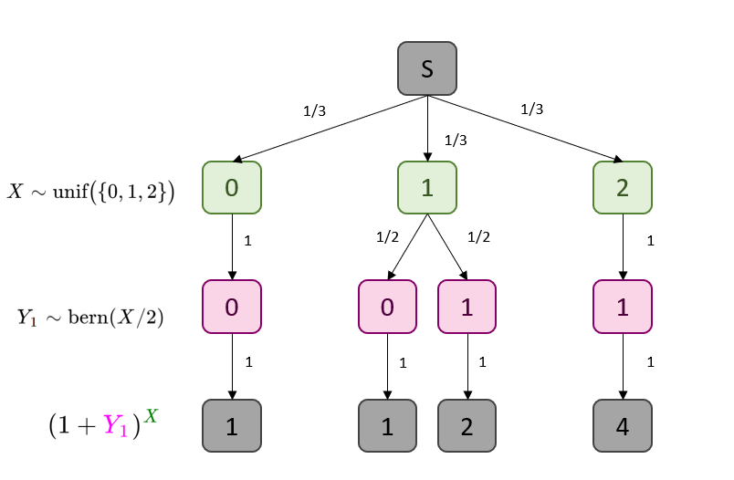

## Question 1 : Sampling from a Joint Distribution

#### Part 1 (INCOMPLETE)
Compute $\mathbb{E}[(1 + Y_1)^X]$ mathematically (with a precise mathematical derivation).


We wish to compute $\mathbb{E}(g, X, Y_1, \dots Y_4).$ In this case, $g(x, y_1, \dots y_4) = (1 + y_1)^x$.  We can hence write the expectation as follows:
      \begin{equation*}
          \mathbb{E}[g(X, Y_1, \dots, Y_4)] = \sum_x \sum_{y_1} \sum_{y_2} \sum_{y_3} \sum_{y_4} g(x, y_1, \dots, y_4)  p(x, y_1, y_2, y_3, y_4).
      \end{equation*}
      

This can be simplified slightly as follows:
      \begin{equation*}
          \mathbb{E}[(1 + Y_1)^X] = \sum_x \sum_{y_1} (1 + y_1)^x p(x, y_1, y_2, y_3, y_4)
      \end{equation*}


Where the specific $y_2, y_3, y_4$ don't matter in this particular calculation.
With this in mind, we can consider the following tree describing this situation:

{#id .class width=50% height=50%}
<!-- We can expand this as follows: -->
<!--       \begin{align*} -->
<!--           \mathbb{E}[(1 + Y_1)^X] = \sum_{x=0}^2 \sum_{y_1 = 0}^1 (1 + y_1)^x p(x, y_1, y_2, y_3, y_4) -->
<!--       \end{align*} -->

Then, applying the Law of the Unconscious Statistician (as seen in the bottom level of this tree), we can find $\mathbb{E}((1 + Y_1)^X)$. We use chain rule to propagate towards the probabilities aligning with the bottom leaves. 
  \begin{equation*}
          \mathbb{E}[(1 + Y_1)^X] = \frac{1}{3}(1) + \frac{1}{6}(1) + \frac{1}{6}(2) + \frac{1}{3}(4) = \boxed{\frac{13}{6}}
      \end{equation*}
<!-- Then, we let $p(x, y_1, \dots)$ be represented in this scenario as $P(X = x)P(Y_1 = y_1)$. -->
      
#### Part 2

Write an R function called `forward_sample` that samples (“simulates”) from the joint distribution of $(X, Y_1, Y_2, Y_3, Y_4)$. As a general practice, fix the seed, and submit both the code and the output (here, a single sample).


```r
library(extraDistr)
set.seed(19690720)
forward_sample <- function(){
      X = rdunif(1, 0, 2)
      return(
        c(X, sapply(1:4, function(x) rbinom(n = 1, size = 1, prob = X/2)))
      )
}
forward_sample()
```

```
## [1] 2 1 1 1 1
```

### Part 3

How can your code and the law of large number be used to approximate $\mathbb{E}[(1 + Y_1)^X]$

Since the Law of Large numbers basically states that average of many *iid* random samples will approach the truth (if it exists), we can use our newly-created `forward_sample()` function to generate many Monte Carlo samples. We can then subset these top-down runs to extract many $x$ and $y_1$ observations, computing $(1 + y_1)^x$ each time. We can then approximate $\mathbb{E}[(1 + Y_1)^X]$ by taking the average of all our simulations. In short, we can generate Monte Carlo samples to generate an

### Part 4


Compare the approximation from your code with you answer in part 1.


Here, we actually conduct the simulations and compare the results to those found by arithmetic operations.


```r
# refresh the seed just in case
set.seed(19690720)
# generate 20,000 simulations
simulations = sapply(1:20000, function(x){
                  sample_i = forward_sample()
                  g_x = (1 + sample_i[2])^sample_i[1]
                  return(g_x)
                })
simulated_mean = mean(simulations)
print(paste("Simulated Value:", simulated_mean))
```

```
## [1] "Simulated Value: 2.1529"
```

```r
print(paste("Calculated Value:", round(13/6, 4)))
```

```
## [1] "Calculated Value: 2.1667"
```

```r
print(paste("Percent Difference: ", 
            round(abs(simulated_mean- 13/6)/(13/6)*100, 4), "%", sep = ''))
```

```
## [1] "Percent Difference: 0.6354%"
```
So we can see that the result found from simulation is very close to that found in **Part 1**.

## Question 2 : Computing a Conditional

Suppose now that you observe the outcome of the 4 coin flips, but not the type of coin that was picked. Say you observe: "heads", "heads", "heads", "heads" = `[0, 0, 0, 0]`.

**Note:** We will use precise and careful notation to solve, not skipping any steps. (Mostly because this is the very first assignment.)

1. Write mathematically: "Given you observe 4 heads, what is the probability that you picked the standard coin?"
    We know that the coin flips are $Y_1, Y_2, Y_3, Y_4$ respectively. Based on the question description, for arbitrary $i \in [1,4]$ the event that a coin is "heads" is $Y_i = 0.$
    Therefore, we can all four flips as the random vector $(Y_1, Y_2, Y_3, Y_4)$. Understanding that selecting the standard coin is the event that $X = 1$, the sentence can be succinctly described as follows:
    $$
    P(X = 1 | (Y_1, Y_2, Y_3, Y_4) = (0, 0, 0, 0))
    $$

2. Now, solve the expression.
    **Solution:** 
    For simplicity, we will let event $E$ be the event that $(Y_1, Y_2, Y_3, Y_4)$ is equal to $(0, 0, 0, 0)$, where again a zero indicates a heads.
    
    We wish to find $P(X = 1 | E)$. We will implement Bayes' Theorem.
    $$
    P(X = 1 | E) = \frac{P(E | X = 1) P(X = 1)}{P(E)}
    $$
    
    We can compute the probability of picking Coin #1 directly.
    $$
    P(X = 1) = P(\text{unif}(\{0, 1, 2\}) = 1) = \frac{1}{3}
    $$
    
    Assuming each $Y_i$ is iid for $i \in [1, 4]$, we can compute $P(E | X = 1)$:
    $$
    P(E | X = 1) = P((Y_1, Y_2, Y_3, Y_4) = (0, 0, 0, 0) | X = 1) = \prod_{i = 1}^4 P(Y_i = 0 | X = 1) = \left(\frac{1}{2^4}\right) = \frac{1}{16}
    $$
    
    Now, we can compute $P(E)$ via the Law of Total Probability. Trivially, we know $P(E | X = 2) = 1$ and $P(E | X = 0) = 0.$
    $$
    P(E) = \sum_{i = 0}^2 P(E | X = i) P(X = i) = (0)\left(\frac{1}{3}\right) + \left(\frac{1}{16}\right)\left(\frac{1}{3}\right) + (1)\left(\frac{1}{3}\right) = \frac{1}{48}+ \frac{1}{3} = \frac{17}{48}
    $$
    
    Putting this all together, we have the following:
    $$
    P(X = 1 | E) = \frac{P(E | X = 1) P(X = 1)}{P(E)} = \frac{(1/3)(1/16)}{(17/48)} = \boxed{\frac{1}{17}}
    $$

## Question 4

We now generalize to having \( K + 1 \) types of coins such that:

- coin type \( k \in \{0, 1, \ldots, K\} \) has bias \( k/K \)
- the fraction of coins in the bag of type \( k \) is \( \rho_k \).

We consider the same observation as before: "you observe 4 heads". We want to find the conditional probability \( \pi_k \), for all \( k \) that we picked coin type \( k \in \{0, 1, \ldots, K\} \) from the bag given the observation.

#### Part 1


Write an R function called `posterior_given_four_heads` taking as input a vector
\( \rho = (\rho_0, \rho_1, \ldots, \rho_K) \) and returning \( \pi = (\pi_0, \pi_1, \ldots, \pi_K) \).


```r
posterior_given_four_heads <- function(rho){
  kvals = 0:(length(rho)-1)
  K = length(kvals)
  # kvals = ( 0:(K-1) )
  biases = kvals / (K-1)
  # in this case, the denominator is from LOTP again
  p_E =  sum( biases^4 * rho )
  # then numerator is P(X)P(E | X)
  prior_likeli =  sapply(1:K, function(k){ biases[k]^4 * rho[k]} ) 
  # then return the ratio
  return(prior_likeli / p_E)
}

# this returns q2
posterior_given_four_heads(rho = c(1/3, 1/3, 1/3))
```

```
## [1] 0.00000000 0.05882353 0.94117647
```
#### Part 2 
Test your code by making sure you can recover the answer in Q. 3 as a special case. Report what values of \( K \) and \( \rho \) you used.


#### Part 3 (INCOMPLETE)
Show the output for \( \rho \propto (1, 2, 3, \ldots, 10) \). Here \( \propto \) means "proportional to"; try to infer what it means in this context.


```r
posterior_given_four_heads((1:10))
```

```
##  [1] 0.000000e+00 1.468882e-05 3.525316e-04 2.379588e-03 9.400843e-03
##  [6] 2.754153e-02 6.662848e-02 1.410714e-01 2.707443e-01 4.818667e-01
```

```r
plot(posterior_given_four_heads((1:10)))
```

<!-- -->


What does "proportional to" mean in this context?

```r
# note that the whole 1 to 10 thing is non-normalized
# so we know the proportionality to 1:10 is the same as
# actually passing the following probabilities
1:10/(sum(1:10))
```

```
##  [1] 0.01818182 0.03636364 0.05454545 0.07272727 0.09090909 0.10909091
##  [7] 0.12727273 0.14545455 0.16363636 0.18181818
```

```r
# also code output is the same
posterior_given_four_heads( 1:10/(sum(1:10)))
```

```
##  [1] 0.000000e+00 1.468882e-05 3.525316e-04 2.379588e-03 9.400843e-03
##  [6] 2.754153e-02 6.662848e-02 1.410714e-01 2.707443e-01 4.818667e-01
```

## Q.5: Generalizing Observations

We now generalize Q. 4 as follows: instead of observing 4 "heads" out of 4 observations, say we observe `n_heads` out of `n_observations`, where `n_heads` and `n_observations` will be additional arguments passed into a new R function.

#### Part 1  (INCOMPLETE)

Write the joint distribution of this modified model. Use the \(\sim\) notation as in Equation 1. Hint: use a Binomial distribution.


#### Part 2

Write an R function called `posterior` taking three input arguments in the following order: a vector \( \rho \) as in Q. 4, as well as two integers, `n_heads` and `n_observations`.


```r
posterior <- function(rho, n_heads, n_observations){
  # this part is the same
  kvals = 0:(length(rho)-1)
  K = length(kvals)
  biases = kvals / (K-1)
  # we need the overall probability of nheads
  p_E =  sum(dbinom(x = n_heads, size = n_observations, p = biases)*rho)
  # then, across the k coins that can be picked
  # then numerator is still P(X)P(E | X)
  prior_likeli =  sapply(1:K, function(k){ 
    dbinom(x = n_heads, size = n_observations, p = biases[k]) * rho[k]} ) 
  # then return the ratio
  return(prior_likeli / p_E)
}
```
#### Part 3 (MAYBE INCOMPLETE)

```r
posterior(c(1/3, 1/3, 1/3), 4, 4)
```

```
## [1] 0.00000000 0.05882353 0.94117647
```
Test your code by making sure you can recover the answer in Q. 3 as a special case.


#### Part 4 (MAYBE INCOMPLETE)
Show the output for \( \rho \propto (1, 2, 3, \ldots, 10) \) and `n_heads = 2` and `n_observations = 10`.


```r
posterior(1:10, 2, 10)
```

```
##  [1] 0.000000e+00 1.628596e-01 3.357600e-01 2.934782e-01 1.516748e-01
##  [6] 4.771276e-02 8.024795e-03 4.870678e-04 2.795670e-06 0.000000e+00
```

```r
plot(posterior(1:10, 2, 10))
```

<!-- -->
