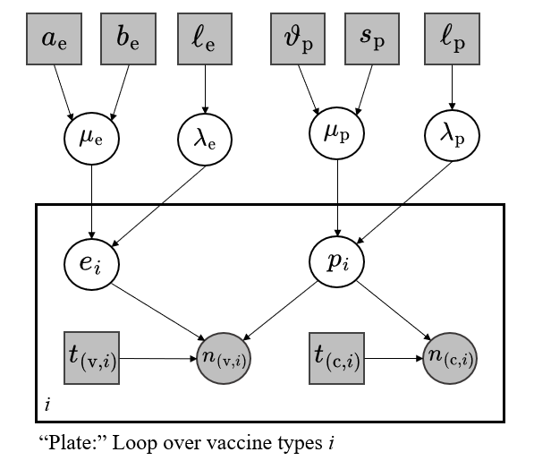

```{r setup, include=FALSE}
knitr::opts_chunk$set(echo = TRUE)
library(extraDistr)
library(ggplot2)
library(pracma)
library(distr)
library(latex2exp)
library(knitr)
source("scaffold.R")
source("simple.R")
source("simple_utils.R")
```

# Question 1: Efficacy of Vaccines


In this exercise we will model the effectiveness of COVID vaccines using clinical trials data. Each trial consists of two arms: vaccinated (i.e., treated) and control (i.e., not treated). For a typical trial we know


- The total number of patients in each arm: $t_v$ (vaccinated),  $t_c$ (control).


- The number of patients that got infected with the SARS-CoV-2 virus in each arm: $n_v$ and $n_c$.

We model  $n_v$ and $n_c$ as Binomial random variables. The unknown parameter for these distributions will depend on two numbers in $[0,1]$


The first is Incidence (denoted $p$): the probability that a patient in the trial will become infected without being treated with the vaccine.

The second is Effectiveness (denoted $e$) the decrease in incidence that the vaccine provides.

We will take $\text{betaMP}(\mu, \lambda)$ distributions rather than $\text{beta}(\alpha, \beta)$. In this instance $\mu \in [0, 1]$ is the *mean* and $\lambda > 0$ is a *precision* parameter. 

The following bijection holds regarding these parameters:
$$
\mu = \dfrac{\alpha}{\alpha + \beta}, \text{ and } \lambda = \alpha + \beta \ \iff \ \alpha = \mu \lambda, \text{ and }  \beta = (1 - \mu) \lambda
$$

There are a few priors in this experiment. 

Firstly, we have the Mean and Precision Priors of Effectiveness, given by a Uniform and Exponential distribution, respectively:
$$
 \mu_e \sim \text{unif}(0,1), \text{ and } \lambda_e \sim \text{exp}(0.001)
$$
This gives us the Effectiveness, as a Likelihood given these Beta Parameters.
$$
\big(e \mid \{\mu_e ,  \lambda_e\} \big) \sim \text{betaMP}(\mu_e, \lambda_e)
$$
We then arrive at the number of infected inoculated individuals $n_v$, which arises as a function of the total number of individuals (the known value $t_{\text{v}}$), the incidence $p$ (whose formulation will be discussed next) and $e$ (discussed above).
$$
\big(n_{\text{v}} \mid \{e ,  p\} \big) \sim \text{binom}(t_{\text{v}}, p(1 - e))
$$

Now, we discuss the Bayesian framework for *all* individuals overall (i.e. "Incidence.")

We have mean incidence and precision assigned priors as follows:

$$
\mu_{\text{p}} \sim \text{betaMP}(0.1, 10), \text{ and } \lambda_{\text{p}} \sim \text{exp}(0.001)
$$
Similarly, we have the likelihood for incidence given these parameters:
$$
\big( p \mid \{\mu_{\text{p}}, \lambda_{\text{p}}\}) \sim \text{betaMP}(\mu_{\text{p}}, \lambda_{\text{p}})
$$
Then, the number of infections in the control group:
$$
\big(n_{\text{c}} \mid p) \sim \text{binom}(t_{\text{c}}, p)
$$

## Part 1

Expand the model in Equation 1 into a hierarchical model that covers both vaccines. The parameters 
$\{\mu_\text{e},\lambda_\text{e},\mu_\text{p},\lambda_\text{p}\}$ must be shared across vaccines. 

In contrast, each vaccine must have its own $(e, p)$ pair.

First, we note the hyper-parameter choice for each of these variables. For uniform $\mu_\text{e}$, we declared parameters $\{a_\text{e}, b_\text{e}\}$ as $\{0, 1\}$. Similarly, we declared $\lambda_\text{e}$ and $\lambda_\text{p}$ as exponential random variables with parameters $\ell_\text{e} = \ell_\text{p} = 0.001$. Finally we declared $\mu_\text{p}$ as a Beta MP random variable with parameters $\{\vartheta_\text{p}, s_\text{p} \}$ as $\{0.1 ,10 \}$. We include these hyper-parameters as constants in our Graphical model, to reflect the fact that these choices were made by us, the designers, and could be changed. 
<center>
{#id .class width=85% height=85%}
</center>


\pagebreak 

## Part 2

Now, with this framework presented, we will inspect the data before implementing Hierarchical Model to describe the setting. 

```{r read_df_time}
df = present = read.csv("vaccines.csv")
colnames(present) = c("Trials", "Arms", "Group Sizes", "Number of Cases")
kable(present)
```

We need to do a `simPPLe` implementation for this, too. The PPL function should return the indicator that Moderna is more effective than Pfizer. We include a hidden code cell that defines the `BetaMP` Distribution.

```{r BetaMP, include=FALSE}
BetaMP = function(mean, precision){
  Beta(mean*precision, (1-mean)*precision)
}
```
