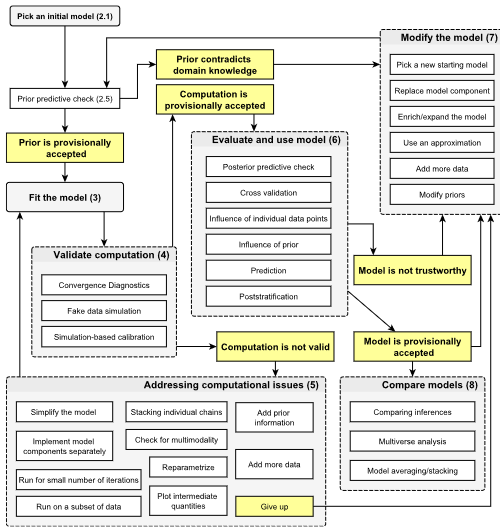

```{r setup, include=FALSE}
library(extraDistr)
library(ggplot2)
library(pracma)
library(distr)
library(latex2exp)
library(knitr)
library(rstan)
library(reticulate)
```


# Bayesian Workflow, Overview

Here is an overview of the workflow:

{#id .class width=80% height=80%}

## Goodness of Fit

Today, we talk about GoF, for Bayesian Models. Something called "posterior predictive checks." We then discuss the limitations of some of these methods.


The main question we are trying to answer is, "is the model mis-specified?" Previously, we have used our own reasoning (and logical tools such as Cromwell's Rule and Ockham's Razor.)


Now, we have quantitative methods. There is always mis-specification but we wish to detect if the model is "grossly mis-specified."


## Calibration: Review

To understand today's material, let's review calibration.

For well specified models, credible intervals are calibrated for small data \underline{and} calibrated for large data.


The question is... Can we do goodness-of-fit tests on latent (unobserved) variables $X$? Recall that a latent variable is one that can only be inferred indirectly through a mathematical model from other variables. Hence, we can only develop a goodness-of-fit on $X \mid Y$. 

In a real data analysis scenario, $x$ is unknown, so we cannot check if $x$ is contained in a corresponding credible interval.

So the fix is to do....

## Prediction : Review

Recall that bayesian models can be used to predict the next observation, $y_{n+1}$. We've done this mathematically ($\mathbb{P}(Y_4 = 1 \mid {Y}_{1:3} = \mathbf{\vec{1}})$,) in simPPLe and in the quiz. 

However, we can also do this in Stan with PPLs! Recall that we **can** do goodness of fit calibration on a prediction, via loss (e.g. RSS = $(y - \hat{y})^2$.) The only problem is we don't know what loss is "good." 


Instead, we can do leave-one-out validation with the Posterior Distribution. Given $\{y_1, y_2, \dots y_{n-1}\}$ and leave out $y_n$. Then, we compute a $(1-\alpha)\%$ Credible Interval $C$ predicting the $n$-th observation $y_n$. Then, if $y_n \not\in C$, output a warning. 


## Posterior Predictive Check

Let $C(y)$ denote a $(1-\alpha)\%$ Credible Interval (e.g. $99\%$) computed from $y$. Let $y_{\lnot n}$ be the data excluding point $n$. We output a warning if $y_n \not\in C(y_{\lnot n})$.


**Proposition**: If the model is well-specified...

$$
\mathbb{P}\big(Y_n \in C(Y_{ \lnot \, n})\big) = 1 - \alpha
$$
The result holds from the general case of well-specified credible intervals.

### What does it mean?
If $Y_n \in C(Y_{ \lnot \, n})$, what does this mean? it means that there's potential mis-specification, bad luck, a software defect (bad code), or if the MCMC is too slow


## Checking Correctnesss

The code implementing Bayesian Models can get complex in real world applications. Complex code means bugs! We can review a powerful method of bug detection in Bayesian Inference software.

The topic here is really "software testing," however we'll avoid that terminology to not conflate it with hypothesis testing.


**From Goodness of Fit to Correctness**

Let's say there are several factors that lead to our goodness-of-fit warning.

How can we modify the previous check to exclude "model mis-specification" as a potential cause? We could either increase the dataset size (Bernstein-von Mises theorem), if $x \in \mathbb{R}^d$ or use simulated data (which is more optimal.)

The logic is similar to Fischerian testing, $H_0: \text{Model is well-specified.}$. Then you forward sample $X, Y \sim \text{joint distribution}$, then $[\text{L}, \text{R}]= C(Y)$ and then check if $X \in [\text{L}, \text{R}]$. For multiple comparison, you can still use stuff like the Bonferroni correction!

## MCMC Diagnostics

Heuristics to detect pathological behaviour (extreme slowness), and methods to estimate effective sample size. We know MCMC is consistent; however, the speed of convergence can vary considerably due to the dependence between the successive draws.

When convergence is slow, there's some fixes we can do.

The good case: **Fast Mixing**


The chain is almost like *iid* samplin, just a \underline{constant time} slower (e.g. 2x slower.) This constant is related to the effective sample size. In the case where it's twice as slow as *iid* sampling, the relative ESS will be $1/2$. Interetingly, Stan estimates ESS when printing a `fit` object, callled `n_eff`.


Fast mixing happens when the dependence between time step $i$ and $i +m$ decays exponentially in $m$ (geometric ergodicity, recall an ergodic Markov chain)


The bad case: **Slow/Torpid Mixing**


The MCMC is still consistent, but you may have to wait for years to get the answer (and by the time it gives the answer, you may have forgotten the question! see: 42.) In this case, changes have to be made to the sampler.


We will cover alternatives to consider these targets, including **Tampering Methods** and **Variational Methods**. 


## Heuristics to detect slow-mixing chains

The key idea is to run several independent chains from "over-dispersed" initializations.
*Over-Dispersed*: use at least as much noise as the prior. 


Then we check for differences between the Trace Plots and the Rank Plots. 


### Example

Let $p = p_1p_2$, where $p_i \sim \text{unif}(0,1)$. This creates an **unidentifiability**. For any value of $p$, there are several possible $p_1$, $p_2$, such that $p_1p_2 = p$. 

Then, the trace plot looks a bit funky. For the easy example, the $n$ (i.e. $n = 2$) markov chains "mix" nicely, in the unidentifiable case, there is an obvious difference in the processes of the two chains. 


```{python, results = FALSE}
from sympy import symbols, simplify
from pytexit import py2tex

# Define symbols
a = symbols('a')

# Original equation's rearrangement
left_side_coefficient = 1 - (1/(6*a))
right_side = (3 - 2*a) / (6*a)

# Simplify the equation for p(1)
rho_1 = simplify(right_side / left_side_coefficient)
# sympy.latex(eval(rho_1))
pytex_obj = py2tex(str(rho_1))
```

```{r, results='asis'}
cat(py$pytex_obj)
```


<!-- @Manual{, -->
<!--   title = {reticulate: Interface to 'Python'}, -->
<!--   author = {Kevin Ushey and JJ Allaire and Yuan Tang}, -->
<!--   year = {2024}, -->
<!--   note = {R package version 1.35.0,  -->
<!-- https://github.com/rstudio/reticulate}, -->
<!--   url = {https://rstudio.github.io/reticulate/}, -->
<!-- } -->