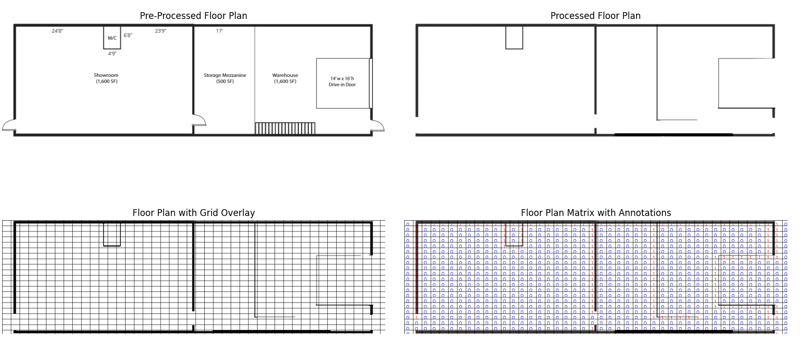
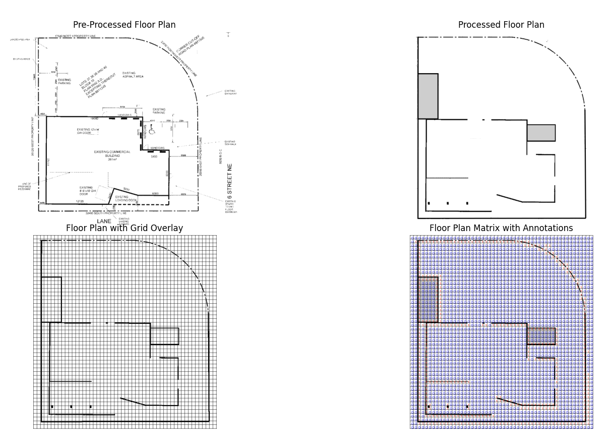

```{r setup, include=FALSE}
knitr::opts_chunk$set(echo = TRUE)
library(extraDistr)
library(ggplot2)
library(pracma)
library(distr)
library(latex2exp)
library(knitr)
library(rstan)
library(reticulate)
library(reshape2)
```

## Overview: Basic Requirements


**Team**: The team will contain me (and nobody else.)


**Project Themes: From the List**

The project will be investigating the "Bayesian vs Frequentist" paradigm, specifically with the context of Reinforcement Learning.


This comparison will be conducted by writing a posterior inference-based method from scratch. The proposal includes a "Toy Example" of this process for the data type in question. Effectively, this also tackles Bayesian inference method over a non-standard data type. 


So, in short, the project themes being addressed are "Bayesian vs Frequentist," "Bayesian inference method over a non-standard data type" with the implementation inspired by some similar works in the field. The "baseline" to which it will be compared is a standard frequentist reinforcement learning method. I have already implemented this in `R` as a weekend project to be better-prepared. In addition I have developed some Python scripts for parsing the data type in question into a utilizable structure. 

**Repository**


There is a working link to a public repo containing commits from all team members.


[Click here for the link to my entire 447 Repository.](https://github.com/cadenhewlett/STAT447)


## Overview: Project

The idea behind this project is to experiment with an implementation of Bayesian Q-Learning as explored in [@paper1], and contrast its performance in environments of varying complexity against a frequentist counterpart. Specifically, we will contrast the Bayesian method to the "classical" example presented in [@paper2], with a Boltzmann exploration policy with temperature as a hyper-parameter to the model, see [@paper3]. These will be the main documents examined in the literature review and utilized throughout the paper, though more may be added as necessary.


In the project, I plan to discuss the statistical mechanics behind Q-Learning in the literature review. However, there will be more focus on the Bayesian implementation (which will be new to me) throughout the remainder of the literature review and implementation.


## Problem Background


While the initial algorithm exploration will be done on simulated data, a "real-world" candidate data set is also very sensible, to highlight the usefulness of both the Bayesian and Frequentist paradigms. If applicable, we can also potentially re-design the rewards space for a given real-world environment to examine the potential benefits and hindrances to a Bayesian framework.


Both algorithms will be training on warehouse floor plans that I gathered online, sourced from [@img1] and [@img2]. URLs are included in the bibliography.


The idea is to design and algorithm for path finding / maze solving within a discretized state space. In the real world, this type of algorithm could be used for autonomous machines moving cargo in warehousing. Amazon, for example, claims that it uses over 750,000 robots in its fulfillment centers as of 2023 [@amazon]. Well-designed and adaptive path finding is crucial in this industry, since efficiency and rapid fulfillment are hallmarks of e-commerce. Reinforcement learning can be applied to design paths via rewards-based exploration rather than pre-planned routes, which could theoretically be used in tandem with existing algorithms to improve efficiency.


I'll discuss briefly how the candidate floor plans were translated into discrete state spaces, as well as my initial thoughts on how to design rewards schema for these environments. 


## Data and Wrangling


The raw data for this project are images of floor plans of warehouses I found online. Since this is a difficult data type to wrangle, I decided to do some pre-processing via Python prior to fully developing the project. 

For each of the two candidate datasets, I followed the following process:


1.) First, I gathered the images from the public-facing Brochures of the listings.


2.) Then, using photo-editing software, I manually edited out labeling and other visual noise. 


3.) The Python script then completed the following process to detect walls and other obstacles (such as parking lots) inferred from the image.


3a.) First, the image is grey-scaled and sectioned into an $m \times n$ grid, where the cell size is proportional to the original image scale and all cell sizes are identical. Concurrently, an empty $m \times n$ Numpy matrix $\mathbf{X}^{k}$ where $k \in [1,2]$ was made for each of the images.


3b.) Second, for each cell in the image, a value of `0` was assigned to the row-column pair $\mathbf{X}^k_{i,j}$ of the data matrix if the cell was wholly white (i.e. contained no obstacles.) Conversely, a value of `1` was assigned to any cell that was not entirely blank (hence detecting an obstacle.)


4.) The resulting matrices were written to CSV files `floor_plan_matrix1.csv` and `floor_plan_matrix2.csv`. In addition, a tertiary matrix was also desgined which simply takes a smaller section of floor plan two for a smaller matrix ($20 \times 20$ rather than $52 \times 52$) in the event that simulation proves too difficult.


\pagebreak
### Candidate 1

The first candidate features a relatively small design, with the potential for "traps" depending on the agent's direction. The stairwell to the storage mezzanine was modeled as an obstacle, but not for the entirety of the length under the assumption the stairs could be approached from the side slightly.


{#id .class width=110% height=130%}
As you can see, the processing makes a few assumptions about the design of the building (such as the drive-in door's accessibility relative to the rest of the building) that could be subject to change. 

We can read in the processed Candidate 1 Matrix in `R` as follows.

This `head()` corresponds to the top-left corner. For example, you can see `V1` is the zeroes in the open side street adjacent to the building, while `V2` is the primary west wall and the first row continues with the northern horizontal wall. 
```{r}
df = read.csv("data/floor_plan_matrix1.csv", header = FALSE)
head(df, )[, 1:10]
```


### Candidates 2 and 3

The second candidate features an expansive design, with logical routes and lots of room for target location and exploration. The third candidate is an adjusted version of Candidate 2 focusing on the main body of the building in case the matrix is too large for thorough computation.

{#id .class width=100% height=100%}
The preview of this data set is given below:
```{r}
df = read.csv("data/floor_plan_matrix2.csv", header = FALSE)
head(df, )[, 1:10]
```

The "simplified" version is previewed below. Additional Information on the area inspected is included in the "images" folder of the GitHub repository (see: `images/simplified_fp_property.png`)

```{r}
df = read.csv("data/floor_plan_matrix3.csv", header = FALSE)
head(df, )[, 1:10]
```


Finally, for the main process, these schematics will be translated into a rewards function $R$, where the walls as indicated by the data will be assigned high negative reward, while distance from the objective is rewarded by distance (either Euclidean or exponential decay by some function of number of cells.) However, the details of this will be included in the main body of the project later.


Thanks for reading!


## Sources (to be used in main work)
\vspace{1mm}


